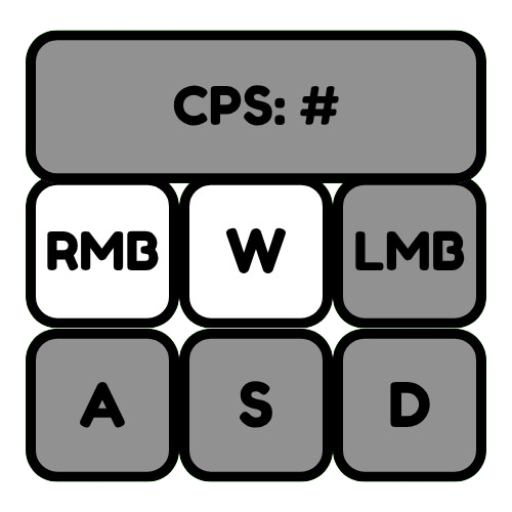

# Keystrokes Web Client
Keystrokes Web Client is a web-based client for the Keystrokes mod in most M.C. Clients, allowing users to see their keystrokes in real-time.
# Installation
1. Download the latest release from the [Releases](https://github.com/yourusername/yourrepository/releases) page.
2. Extract the contents of the zip file to a directory of your choice.
3. Open the `index.html` file in your web browser.
# Usage
To use the Keystrokes Web Client, simply open the `index.html` file in your web browser. The client will automatically connect to the Keystrokes mod and display your keystrokes in real-time.
# Features
- Real-time keystrokes display
- Customizable appearance
- Lightweight and fast
# Screenshots

